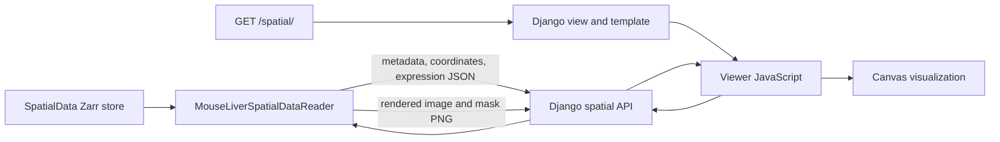
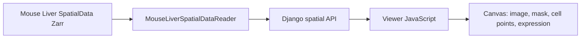
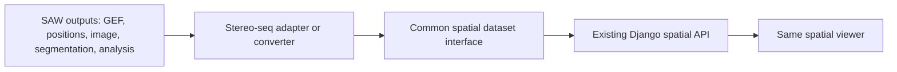

# Spatial Viewer and Disk Usage Investigation

**Inspected:** 2026-09-28  
**Scope:** Read-only investigation of `/usr`, the current Django spatial viewer, its demo inputs, and Stereo-seq/SAW compatibility. No application code was changed.

## 1. `/usr` Disk Usage

`du` reports **8.4 GB** under `/usr`. It is on the container root overlay, not the repository directory. `/workspaces` is a separate ext4 mount; `/tmp` is another filesystem. At inspection time, `df` reported the root overlay and `/workspaces` at 29 GB used out of 32 GB, with about 750 MB available. Visible files under `/` totaled about 11 GB, so the container's filesystem accounting includes substantial space not attributable to visible files in this container. No files were deleted.

| Path | Approx. size | Main contents |
| --- | ---: | --- |
| `/usr/local` | 5.3 GB | Python runtimes and packages, SDKMAN, Node/NVM, command-line tools, Ruby, Go, PHP, and Python development utilities |
| `/usr/share` | 1.1 GB | .NET, including 404 MB of SDKs, 204 MB of shared runtimes, and 191 MB of packs |
| `/usr/lib` | 1.3 GB | LLVM 18 (661 MB), x86_64 libraries (455 MB), Python and GCC libraries |
| `/usr/bin` | 416 MB | Standard and development commands |

Further contributors under `/usr/local`:

- Python installs: 2.2 GB total (`3.14.2`: 1.8 GB; `3.13.8`: 398 MB). Python 3.14 site-packages use about 1.4 GB; large packages include `llvmlite` (173 MB), `pyarrow` (156 MB), SciPy (110 MB), pandas (74 MB), and statsmodels (66 MB).
- SDKMAN: 914 MB, mostly Java (734 MB) and Gradle (165 MB).
- Node via NVM: 523 MB, with two installed Node versions (459 MB total) and 61 MB of downloaded Node archives.
- `/usr/local/bin`: 502 MB, including Copilot (154 MB), Minikube (143 MB), Helm (63 MB), kubectl (60 MB), and Docker Compose (31 MB).
- Ruby: 313 MB; Go: 282 MB; Python utility environments: 204 MB; PHP: 173 MB; Hugo: 58 MB.

There is no CUDA installation or R package tree in the inspected `/usr`. Conda exists separately at `/opt/conda` (about 1.3 GB), not under `/usr`. Docker client tools are present, but Docker image/build storage is separate from `/usr`.

The only clearly regenerable item identified under `/usr` was the 61 MB NVM archive cache. It was left intact; clearing it would have little impact compared with the installed runtimes and libraries. System software should not be manually removed from the live container. To reduce this footprint, change/rebuild the Codespaces image rather than deleting packages from `/usr`.

## 2. Current Spatial Viewer Data Flow

The default `/spatial/` page selects dataset ID `mouse_liver_demo`. Django renders the page and template; the browser JavaScript then calls the spatial API. The backend reader opens the local Zarr store with `spatialdata.read_zarr`. The browser never opens Zarr, H5AD, GEF, or image files directly.



The route definitions are in [datamodel_demo/urls.py](../datamodel_demo/datamodel_demo/urls.py#L48-L55); the page and endpoint views are in [views.py](../datamodel_demo/app1/views.py#L130-L229). The reader path and Zarr loading are in [spatial.py](../datamodel_demo/app1/spatial.py#L119-L143), and browser requests/rendering are in [spatial-viewer.js](../datamodel_demo/app1/static/app1/spatial/spatial-viewer.js#L12-L19).

Endpoints used by the viewer:

- `/api/spatial/<id>/metadata/`
- `/api/spatial/<id>/coordinates/`
- `/api/spatial/<id>/expression/?gene=<gene>` or `?overall=true`
- `/api/spatial/<id>/image/`
- `/api/spatial/<id>/mask/`

The browser loads metadata and up to 50,000 coordinates when the page opens. The image layer starts enabled; the segmentation overlay starts unchecked. Gene-specific or overall expression is requested when the user selects it. Although the API accepts spatial bounds, the browser does not currently use viewport-based requests.

### Dataset location and runtime

The configured path `SPATIALDATA_MOUSE_LIVER_PATH` is unset in this environment. The default path is:

```text
/workspaces/SGBC_data_model/datamodel_demo/data/spatial/mouse_liver.zarr
```

The project contains this demo as a directory-based SpatialData Zarr store. [The download script](../scripts/download_spatialdata_demo.sh#L1-L21) downloads a versioned archive, verifies its checksum, and extracts the store. Compose bind-mounts `datamodel_demo` into `/app`; the Dockerfile installs the project dependencies. The reader uses `spatialdata.read_zarr`; it does not call `spatialdata-io` to load SAW/GEF files.

The demo store contains an image pyramid, a segmentation label image, an AnnData-style table with 3,375 rows and 99 genes, nucleus polygons, and transcript points. The reader accesses `tables["table"].obsm["spatial"]`, `table.X`, `table.obs`, and `table.var_names`. It derives `genes_detected` and `total_counts` from the expression matrix, and reads `cell_ID` and `annotation` from observations. The implementation is in [spatial.py](../datamodel_demo/app1/spatial.py#L152-L190).

The image endpoint reads `images["raw_image"]["scale1"]`, applies percentile-based grayscale scaling, and returns a PNG. The mask endpoint samples `labels["segmentation_mask"]` at a stride of four, assigns a deterministic palette, makes label zero transparent, and returns a PNG. These rendered responses are generated in memory, not written as cached image files. See [spatial.py](../datamodel_demo/app1/spatial.py#L239-L267).

## 3. Current Input Files

The common prefix for the actual on-disk groups below is:

```text
/workspaces/SGBC_data_model/datamodel_demo/data/spatial/mouse_liver.zarr/
```

The root Zarr metadata is at [zarr.json](../datamodel_demo/data/spatial/mouse_liver.zarr/zarr.json). The store uses Zarr chunks, so the array data are files within group directories rather than standalone TIFF/H5AD files.

| Layer | Required input | Format | Actual location | Reader / API | Status |
| --- | --- | --- | --- | --- | --- |
| Tissue image | `images["raw_image"]`, with pyramid level `scale1` | OME-NGFF multiscale image in Zarr; `scale1` is 1 × 1608 × 1608 uint16 | `images/raw_image/1/` | `get_image()` / `image/` | Supported; rendered as PNG and shown by default |
| Tissue mask | `labels["segmentation_mask"]`, 6432 × 6432 int32 | OME-NGFF label array in Zarr | `labels/segmentation_mask/0/` | `get_mask()` / `mask/` | Supported as the UI's “Segmentation mask”; no separate tissue-only mask exists |
| Cell mask / boundaries | Same segmentation label array; nucleus polygons are also in the store | Label array plus Parquet-backed SpatialData shapes | `labels/segmentation_mask/0/`; `shapes/nucleus_boundaries/shapes.parquet` | Mask uses `get_mask()` / `mask/`; no polygon endpoint | Mask overlay renders. Nucleus boundaries are detected in metadata but marked not rendered |
| Spatial coordinates | `table.obsm["spatial"]` plus row-aligned `obs["cell_ID"]` | AnnData-style arrays in Zarr; 3375 × 2 float64 coordinates | `tables/table/obsm/spatial/`; `tables/table/obs/cell_ID/` | `get_coordinates()` / `coordinates/` | Supported |
| Gene expression | `table.X` and `table.var_names` | Sparse CSR matrix encoded in Zarr; 3375 × 99, 44,440 nonzero values | `tables/table/X/{data,indices,indptr}/`; `tables/table/var/_index/` | `get_expression()` / `expression/?gene=...` | Supported for a selected gene or total counts; raw counts, maximum 50,000 rows |
| Transcript points | `points["transcripts"]` | Parquet-backed SpatialData points; `part.0.parquet` is about 8.4 MB | `points/transcripts/points.parquet/part.0.parquet` | No reader method or API | Present but not read or rendered; project docs identify 1,153,548 points |
| Cell metadata | `obs["cell_ID"]` and `obs["annotation"]`; counts are derived from `X` | AnnData observations in Zarr | `tables/table/obs/cell_ID/`; `tables/table/obs/annotation/` | Included in `coordinates/` response | IDs and annotations supported; `fov_labels` is stored but unused |
| Clusters | No cluster assignments in this Mouse Liver dataset | None | None | No cluster API for this reader | Not supported for Mouse Liver. Synthetic demo cluster labels are generated in memory and are not biological data |
| UMAP | No `obsm["X_umap"]` in the store; `obsm` contains only `spatial` | None | None | No UMAP API or renderer | Not present or supported |

There is no distinct `cell_mask` layer in the current reader. The segmentation mask is exposed to the UI as `tissue_mask`; `nucleus_boundaries` is a separate shape layer and is not drawn. The metadata marks transcripts and boundaries as present but non-renderable. The `annotation` layer is not a computed cluster result.

A search of the workspace and user home found no standalone `.gef`, `.h5`, `.h5ad`, `.tif`, `.tiff`, `.png`, or `.jpg` spatial inputs. The only Parquet spatial data found are the transcript points and nucleus shapes inside the Zarr store.

## 4. My Stereo-seq Data Mapping

The project’s [rat-brain sample text](../datamodel_demo/stomics_rat_brain_sample.txt) is descriptive provenance metadata, not a spatial input loaded by this viewer. It describes SAW 8.1 / StereoMap 4.1 outputs, including a 541 MB analysis archive and a 9.32 GB `barcodeToPos.h5`. Neither listed file nor any GEF is present in the workspace.

| SAW/Stereo-seq data | Corresponding spatial information | Current app compatibility |
| --- | --- | --- |
| `*.gef` variants | Expression and bin/cell positions, depending on GEF type and workflow | No GEF/HDF5 reader; convert to the table fields the reader expects or implement an adapter |
| `barcodeToPos.h5` | Barcode-to-x/y lookup | No HDF5 coordinate reader. It may be redundant when the chosen GEF already contains positions |
| Tissue image, often TIFF/OME-TIFF | Morphology image background | No direct TIFF reader; convert/store as SpatialData `images["raw_image"]` |
| Tissue/cell segmentation output | Label mask or cell boundaries | No SAW-specific mask reader; convert to `labels["segmentation_mask"]`. Shape polygons also need a new endpoint/renderer |
| Cluster assignments | Per-cell/bin categories | No imported cluster field or cluster API; `annotation` is only displayed if supplied |
| UMAP coordinates | 2D embedding coordinates | No UMAP endpoint or panel; `obsm["X_umap"]` is not rendered even if present |
| Transcript-level coordinates, if supplied | Individual transcript marks | No points endpoint or renderer; not required for the current cell/bin view |

GEF product variants and their internal groups differ by SAW workflow/version. In general, GEF is the expression/bin or cell-bin data source, while `barcodeToPos.h5` supplies barcode positions; a specific user's files must be inspected before choosing which is redundant. Tissue images and analysis results are separate inputs unless included in the particular export.

To reproduce the current real-data view with the existing reader, prepare a SpatialData Zarr store with `tables["table"]`, `table.X`, `table.var_names`, `table.obsm["spatial"]`, `table.obs["cell_ID"]`, and `table.obs["annotation"]`. Add `labels["segmentation_mask"]` for mask display and, in the current implementation, for nonzero canvas dimensions. Add `images["raw_image"]` for the tissue background. These arrays must share a consistent coordinate frame and row/cell identifiers. The path override only changes where the hard-coded `mouse_liver_demo` reader loads from; dataset name/species/platform metadata remain Mouse Liver/Molecular Cartography.

## 5. Missing Pieces

Before loading Stereo-seq data directly, the application needs:

- A GEF reader and, if required by the selected output, a `barcodeToPos.h5` coordinate adapter.
- A generic dataset registry that selects a reader and supplies dataset-specific metadata. Provenance-registered datasets currently expose metadata but have no compatible data reader.
- Adapters for tissue images and segmentation products, including stable alignment of image, mask, coordinates, and IDs.
- A transcript points API and renderer, plus a nucleus-boundary API and polygon renderer.
- Cluster import/rendering and UMAP import/rendering.
- More robust spatial dimensions when a segmentation mask is absent. Currently width and height default to zero without it.
- Viewport/tile or multiscale loading for large images and point sets; current responses send full-frame PNGs and the browser loads coordinates in one request.

**Current architecture**



**Future Stereo-seq architecture**



No tests or application changes were made as part of this investigation. The existing modification to `datamodel_demo/app1/test_spatial.py` and the untracked `prompt3.txt` were left untouched.
