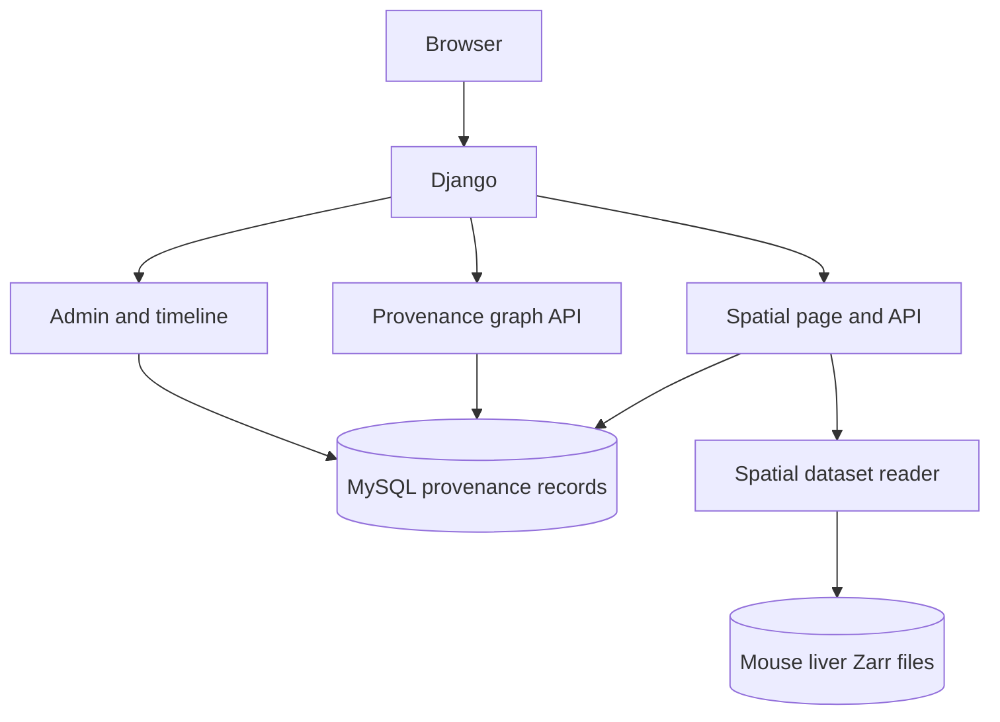
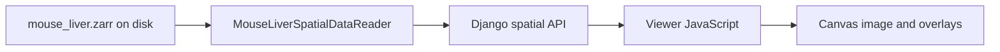

# SGBC Web App and Spatial Viewer Guide

This document describes the Django application as it currently exists, with extra detail on how the spatial viewer obtains and displays data. It distinguishes working features from layers that the dataset contains but the viewer does not yet draw.

## 1. Application at a glance

The project is a Django application for biological-material provenance. It has three main user-facing areas:

| URL | Purpose |
| --- | --- |
| `/admin/` | Browse and edit Django-managed provenance records and vocabularies. |
| `/admin/activity-timelines/` | Browse entities and their ordered activity history. |
| `/graph/` | Explore entities and activities as a connected provenance graph. |
| `/spatial/` | View the default mouse-liver spatial dataset. |
| `/spatial/<dataset_id>/` | Open the spatial viewer for a particular dataset identifier. |

The application runs in the `web` Compose service. MySQL runs separately in the `db` service. JupyterLab is available as a development service on port 8888.



MySQL stores structured application data: entities, activities, their input/output links, versioned information records, vocabularies, agents, protocols, and process parameters. It does **not** store the mouse-liver image or expression matrix. Those remain files in the SpatialData Zarr store.

## 2. Provenance model

The central provenance relationship is:

```text
Entity --input--> Activity --output--> Entity
```

An `Entity` identifies a biological, physical, or digital thing. An `Activity` identifies an event such as extraction, fixation, imaging, or computational processing. `ActivityEntity` links entities to activities through typed input/output ports, allowing activities with multiple inputs and outputs.

Entity and activity identity is kept separate from changing knowledge about them. `EntityInformationRecord` and `ActivityInformationRecord` store versioned sidecar information; activity parameters are recorded separately. For example, an entity can retain the same identity while its known storage location or status changes by adding a newer information-record version.

The graph page obtains nodes and links from `/api/graph/`. The graph is a visualization of the provenance database, not a rendering of spatial image data. The spatial viewer is a separate data path that reads files through a dataset reader.

## 3. Spatial viewer data path

The default viewer route, `/spatial/`, uses dataset ID `mouse_liver_demo`. Its data path is:



The browser never opens a Zarr, H5AD, GEF, or other dataset file. Django reads the local Zarr store and returns metadata, selected coordinates and expression values as JSON, and rendered PNGs for image layers.

### Dataset location and installation

The reader looks for the store at:

```text
datamodel_demo/data/spatial/mouse_liver.zarr
```

You can override that location with `SPATIALDATA_MOUSE_LIVER_PATH`. The sample is downloaded from the official SpatialData dataset bucket by [scripts/download_spatialdata_demo.sh](scripts/download_spatialdata_demo.sh). The script selects a versioned archive, verifies its SHA-256 checksum, and extracts the store. The data directory is ignored by Git and excluded from the Docker build context; Compose makes it available through the existing `datamodel_demo:/app` bind mount.

The documented demo is a small subset of a mouse-liver Molecular Cartography dataset (Guilliams et al. 2022). The SpatialData dataset page lists this sample as CC BY 4.0. The app pins `spatialdata==0.8.0` and `spatialdata-io==0.7.1`. It currently loads this demo with `spatialdata.read_zarr`; it does not yet use `spatialdata-io` to read a Stereo-seq/GEF file.

### What is inside the sample

The loaded Zarr store contains these main elements:

| SpatialData element | Stored data | Current viewer use |
| --- | --- | --- |
| `images['raw_image']` | Multiscale grayscale tissue image; full level is 6,432 x 6,432 pixels, with a 1,608 x 1,608 preview level. | Served as a grayscale PNG and drawn as the canvas background. |
| `labels['segmentation_mask']` | Integer-labeled segmentation image, 6,432 x 6,432 pixels. | Sampled every fourth pixel, colorized with transparent background, and served as an aligned PNG overlay. |
| `tables['table']` | AnnData table with 3,375 cells and 99 genes. `X` contains sparse raw gene counts. | Supplies stable cell IDs, spatial coordinates, annotations, and single-gene expression values. |
| `shapes['nucleus_boundaries']` | 3,375 nucleus polygons. | Discovered in metadata, but polygon outlines are not rendered yet. |
| `points['transcripts']` | 1,153,548 transcript points with x, y, and gene fields. | Discovered in metadata, but individual transcripts are not rendered yet. |

The table's `obsm['spatial']` gives each cell's x/y coordinates. Its `obs['cell_ID']` values join to the nucleus-boundary IDs and the mask labels. `obs['annotation']` contains dataset annotations. These are annotations, not newly computed clusters. The sample has no UMAP embedding, and the viewer does not claim that it does.

### Data needed for visualization

A basic spatial cell view needs:

1. **Coordinates:** one stable ID and x/y position per cell, spot, or spatial bin. Without these, the browser has nothing to place on the canvas.
2. **A spatial frame:** image width and height, or coordinate bounds, so coordinates and raster layers use the same scale.
3. **Optional image:** provides tissue morphology behind the cell positions.
4. **Optional mask or segmentation:** provides labeled regions or cell areas to overlay on the image.
5. **Optional per-cell annotations:** adds metadata-driven coloring and selection details.
6. **Optional expression matrix and gene names:** enables searching for one gene and coloring cells by that gene's values. The gene values must map to the same cell IDs as the coordinates.

The image and coordinates are enough to place cells. The mask is an additional visual context layer. Expression is not necessary to show the tissue, but is required for gene-expression visualization. Cell IDs are what keep coordinates, expression, segmentation, and selection connected.

## 4. What happens when `/spatial/` opens

The default page is defined by Django in `spatial_viewer`; it passes the dataset ID into the existing HTML template. The template provides the canvas, toolbar, layer panel, gene search, status line, and selection details.

The browser then performs these steps:

1. Reads the dataset ID from the page's `data-dataset-id` attribute.
2. Requests `/api/spatial/mouse_liver_demo/metadata/`.
3. Uses metadata to fill in the dataset name, species, dimensions, number of cells and genes, and available/renderable layer controls. The 99-gene list comes from the dataset; it is not hardcoded in JavaScript.
4. Requests `/api/spatial/mouse_liver_demo/coordinates/` for the cell positions and available cell metadata.
5. Loads the PNG image for the default-on tissue-image layer. The tissue mask is available as an optional overlay and starts unchecked.
6. Draws the image and cell-center marks on one HTML Canvas. It does not create thousands of HTML elements.

At the default view, the spatial-cell and cell-annotation layers are enabled. The image is also enabled. The cell-annotation colors are derived consistently from the annotation text; they are not cluster-analysis output.

## 5. Spatial API

All spatial URLs are routed by Django in `datamodel_demo/datamodel_demo/urls.py` and implemented in `datamodel_demo/app1/views.py`. The reader implementations are in `datamodel_demo/app1/spatial.py`.

| Endpoint | Response and purpose |
| --- | --- |
| `/api/spatial/` | Lists known demo and provenance-registered datasets. |
| `/api/spatial/<id>/metadata/` | Dataset dimensions, gene names, counts, and per-layer `available`/`renderable` capabilities. |
| `/api/spatial/<id>/coordinates/` | Cell IDs, x/y, annotations, genes detected, and total counts. Supports `limit` and optional `xmin`, `xmax`, `ymin`, `ymax`. |
| `/api/spatial/<id>/expression/?gene=Axl` | Values for one named gene and its cell IDs/coordinates, plus scale and returned min/max. Does not return the full expression matrix. |
| `/api/spatial/<id>/image/` | Rendered tissue image as `image/png`. |
| `/api/spatial/<id>/mask/` | Rendered segmentation overlay as `image/png`. |

Coordinate and expression queries accept a maximum `limit` of 50,000 points and can be bounded by all four spatial-bound parameters together. The current mouse-liver viewer requests all 3,375 cells, which is below that cap. Although the API accepts spatial bounds, viewport-based lazy loading is not yet wired into the browser. Image and mask responses are full-frame previews rather than tiled image requests.

Expression values are the stored **raw counts**. The app does not apply log transformation or normalization. The response reports the returned values' minimum and maximum, and the viewer maps that range to a color scale. If a gene is selected, the gene-expression checkbox is enabled and the cells are redrawn using those values.

## 6. Using the spatial viewer

Open `/spatial/` on the running web app. You should see the grayscale tissue image with colored cell-center marks, a layer list, and dataset details.

- **Tissue Image:** show or hide the grayscale image.
- **Segmentation Mask:** show or hide colored segmentation labels over the tissue. Use the opacity slider to tune visible overlays.
- **Spatial cells:** show or hide the cell-center marks.
- **Cell annotations:** color cells by their provided annotation. This is not a computed clustering result.
- **Gene:** type or choose a gene such as `Axl` and press **Load**. The viewer requests that gene only and colors cells by its raw count. The legend shows the returned minimum and maximum.
- **Fit view:** center and scale the full data frame.
- **Reset:** return to the fitted view.
- **Pan and zoom:** drag to pan and use the mouse wheel to zoom around the pointer.
- **Cell selection:** click a cell mark to highlight it and show its ID, coordinates, annotation, genes detected, and total counts where present.

If the viewer appears blank or remains on “Loading,” first use a hard refresh (`Ctrl+Shift+R` on Windows/Linux or `Cmd+Shift+R` on macOS). The viewer script URL includes a version query to prevent an older cached script from being reused. In browser developer tools, the page should load the `metadata`, `coordinates`, and `image` requests with HTTP 200. Request the `mask` endpoint only after enabling the Segmentation Mask layer. Confirm that Codespaces port 8000 is forwarded to this running workspace and that the page URL ends in `/spatial/`.

## 7. What the viewer does not do yet

The current milestone is a small-data image/cell/expression viewer, not a complete spatial-analysis platform:

- Nucleus-boundary polygons and individual transcript points exist in the demo and are reported as available, but are marked not rendered in the layer panel.
- The dataset has no UMAP. It does not provide a cluster result in this implementation. Both controls are disabled rather than simulated.
- There is no spatial-to-UMAP linked selection, clustering workflow, gene normalization, or differential-expression analysis.
- The browser currently loads all cell positions and the complete image preview. The viewport-bound API is a foundation for future large-dataset loading, but canvas tiling, downsampling by viewport, caching policy, and large-scale LOD are not implemented.
- GEF/Stereo-seq file reading is not integrated. `spatialdata-io` includes a `stereoseq` reader entry point in the installed version, but compatibility with a specific SAW/GEF file has not been validated here.

## 8. Other development and test commands

Start the database and Django/Jupyter services, download the sample, then migrate Django tables:

```bash
./scripts/download_spatialdata_demo.sh
docker compose up -d --build
docker compose exec web python manage.py migrate
```

The app is published on port 8000. Run the system check and tests with:

```bash
docker compose exec web python manage.py check
docker compose exec web python manage.py test --settings=datamodel_demo.test_settings
```

The test settings use an in-memory SQLite database so tests do not depend on MySQL. The production app settings use MySQL. The spatial tests exercise the real sample when the Zarr store is present; they skip those real-data checks if the download has not been run.
